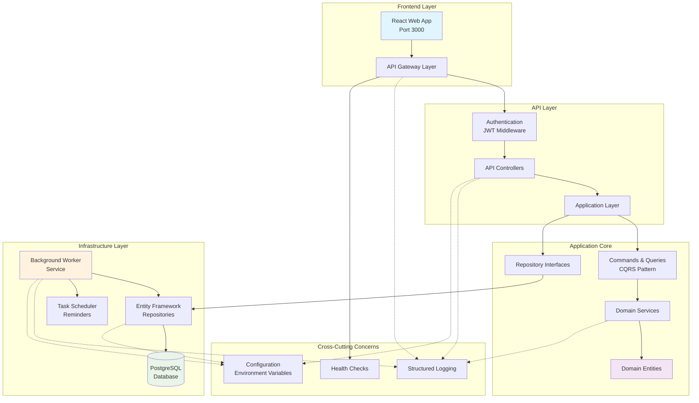
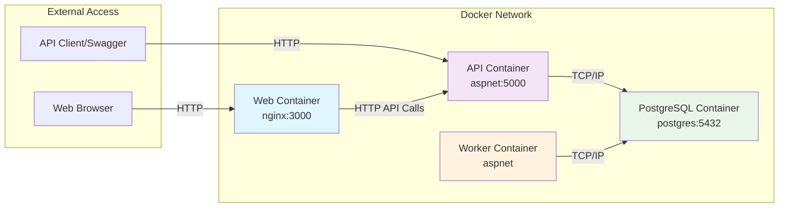
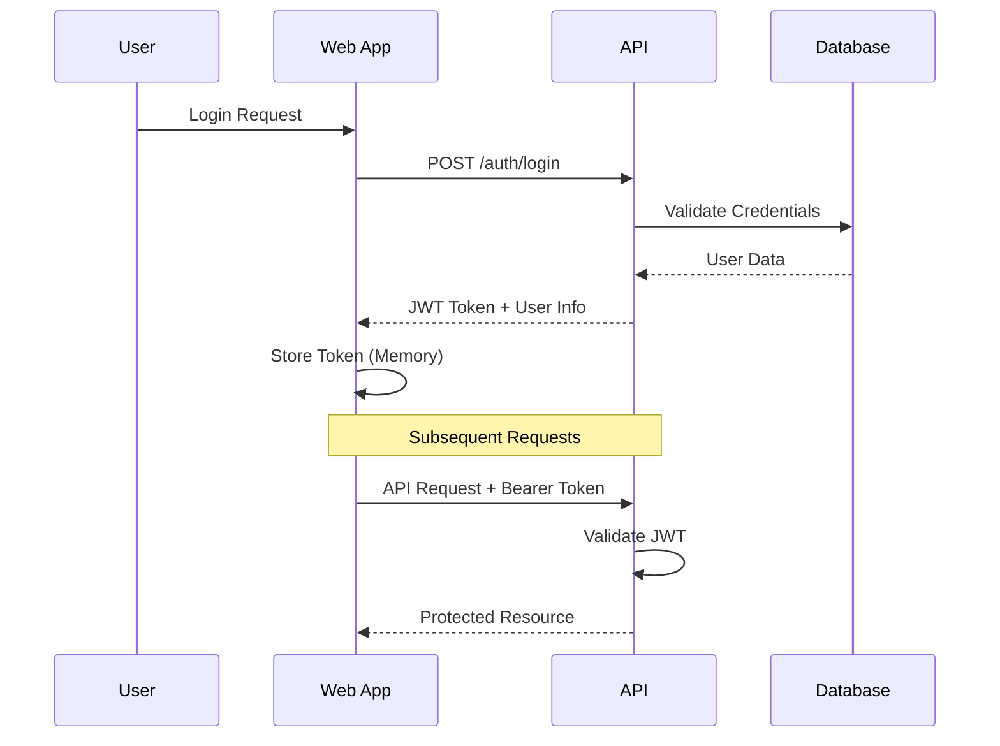
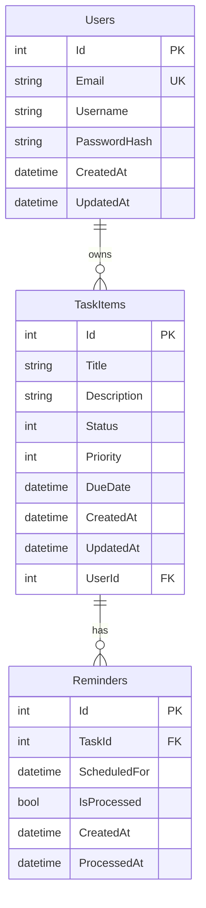
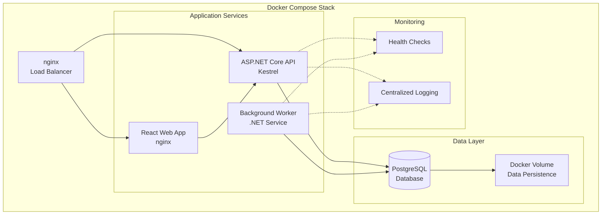

# System Architecture Diagram

This document describes the high-level architecture of the Banayan Task Tracker system.

## 🏗️ System Overview

The Task Tracker follows a **Clean Architecture** pattern with clear separation of concerns across multiple layers and services.

## 🎯 Architecture Diagram



## 🏛️ Architectural Layers

### 1. Presentation Layer
- **React Frontend**: Single Page Application with TypeScript
- **API Controllers**: ASP.NET Core Web API endpoints
- **Responsibilities**: User interface, HTTP request/response handling

### 2. Application Layer
- **Commands & Queries**: CQRS pattern for operation separation
- **Application Services**: Business workflow orchestration
- **DTOs**: Data transfer objects for API contracts
- **Responsibilities**: Use case implementation, business workflow coordination

### 3. Domain Layer
- **Entities**: Core business objects (TaskItem, User, Reminder)
- **Value Objects**: Immutable objects with validation
- **Domain Services**: Business logic that doesn't belong to entities
- **Interfaces**: Abstractions for external dependencies
- **Responsibilities**: Business rules, domain logic, entity behavior

### 4. Infrastructure Layer
- **Data Access**: Entity Framework Core repositories
- **External Services**: Email, logging, configuration
- **Background Services**: Worker service for reminders
- **Responsibilities**: Data persistence, external integrations

## 🔄 Data Flow

### 1. API Request Flow
```
User Input → React Component → API Call → JWT Middleware → Controller → 
Application Service → Domain Logic → Repository → Database
```

### 2. Background Processing Flow
```
Timer Trigger → Worker Service → Application Service → Domain Logic → 
Repository → Database → Notification Processing
```

## 🌐 Network Architecture



## 🔒 Security Architecture

### Authentication Flow


### Security Measures
- **JWT Tokens**: Stateless authentication with expiration
- **Password Hashing**: bcrypt for secure password storage
- **HTTPS**: SSL/TLS encryption in production
- **CORS**: Cross-origin request protection
- **Input Validation**: Data validation at API boundaries

## 📊 Data Architecture

### Entity Relationship Diagram


## 🚀 Deployment Architecture

### Container Orchestration


## 📈 Scalability Considerations

### Horizontal Scaling Opportunities
- **Web Tier**: Multiple React app instances behind load balancer
- **API Tier**: Multiple API instances with shared database
- **Background Processing**: Multiple worker instances for different tasks

### Vertical Scaling Points
- **Database**: Increased CPU/Memory for PostgreSQL
- **API Server**: More cores for request processing
- **Cache Layer**: Redis for session/data caching (future enhancement)

## 🔧 Technology Decisions

| Component | Technology | Rationale |
|-----------|------------|-----------|
| **Frontend** | React + TypeScript | Type safety, component reusability, modern ecosystem |
| **Backend API** | ASP.NET Core 8 | High performance, cross-platform, rich ecosystem |
| **Database** | PostgreSQL | ACID compliance, JSON support, mature and reliable |
| **Authentication** | JWT | Stateless, scalable, standard |
| **Background Processing** | .NET Worker Service | Integrated with .NET ecosystem, reliable |
| **Containerization** | Docker + Compose | Environment consistency, easy deployment |
| **Architecture Pattern** | Clean Architecture | Separation of concerns, testability, maintainability |

## 🔍 Quality Attributes

### Performance
- **API Response Time**: < 200ms for standard operations
- **Database Queries**: Indexed for common lookup patterns
- **Frontend Bundle**: Code splitting for optimal load times

### Reliability
- **Health Checks**: API and database connectivity monitoring
- **Error Handling**: Graceful degradation and user feedback
- **Logging**: Structured logging for debugging and monitoring

### Maintainability
- **Clean Architecture**: Clear separation of concerns
- **Dependency Injection**: Loose coupling between components
- **Testing Strategy**: Unit and integration tests for confidence

### Security
- **Authentication**: JWT-based with proper validation
- **Authorization**: User-specific data access controls
- **Input Validation**: Comprehensive data validation at boundaries